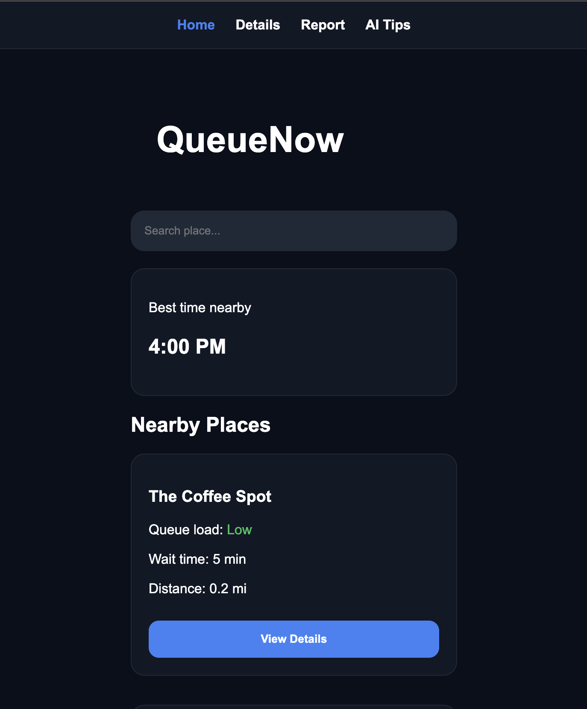
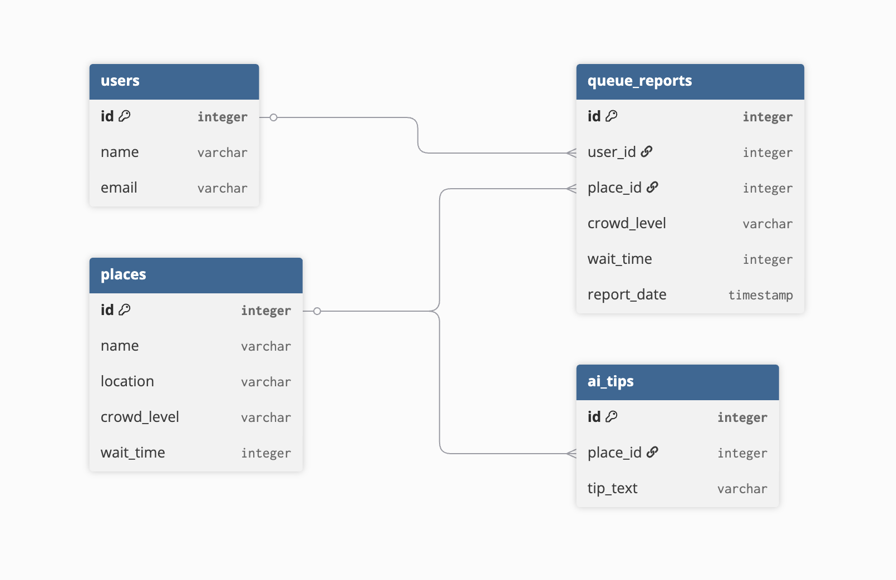

# QueueNow
## Application Preview



## Overview

QueueNow is a web application that helps users check real-time wait times and crowd levels at nearby places. The platform also provides AI-powered recommendations and predictions to help users choose the best time to visit.

## Problem Statement

People often waste time waiting in long lines at coffee shops, restaurants, service centers, and other busy locations. Existing solutions usually provide limited or outdated information about crowd levels.

QueueNow helps users make better decisions by providing wait-time estimates, crowd reports, and AI-based insights for predicting less busy times.

## Target Audience

QueueNow is designed for:

- Students
- Office workers
- Shoppers
- Anyone who wants to avoid long waiting times

Users can quickly check crowd levels before visiting a location and receive recommendations for better visiting times.

## Competitors and Differentiation

### Existing Solutions

- Google Maps
- Waze
- Business-specific queue applications
- Phone calls to businesses
- Manual checking and personal experience

### QueueNow Advantages

- Focused specifically on queue and crowd management.
- Simple and user-friendly interface.
- Community-based crowd reports.
- AI-powered predictions and recommendations.
- Quick access to nearby locations and estimated wait times.

## Live Demo

https://queuenow-omega.vercel.app

## Features

- View nearby places
- Check estimated wait times
- View place details
- Submit crowd reports
- AI Tips and recommendations
- Responsive React interface

## Technologies Used

- React
- Vite
- React Router
- JavaScript
- CSS
- Vercel

## Run Locally

```bash
npm install
npm run dev
```
## Database ERD

The following ERD represents the planned database structure for QueueNow.



## External Services and Integrations

| Service | Type | Purpose |
| --- | --- | --- |
| Vercel | Hosting / Deployment | Hosts the live QueueNow application and enables online access to the project. |
| GitHub | Source Control | Stores and manages the project source code and version history. |
| AI Recommendation Feature (Conceptual) | AI Feature | Demonstrates smart recommendations and suggested visiting times using demo data. |
| Google Maps API (Planned) | Maps / Location API | Planned for future versions to support location-based place discovery and navigation. |
| Supabase (Planned) | Backend / Database / Authentication | Planned for future development to manage real-time data, user authentication, and queue reports. |

QueueNow was developed as a frontend MVP (Minimum Viable Product) using demo data. The current version demonstrates the main user flow and core concept of the application. Backend services and external API integrations are planned for future development.
